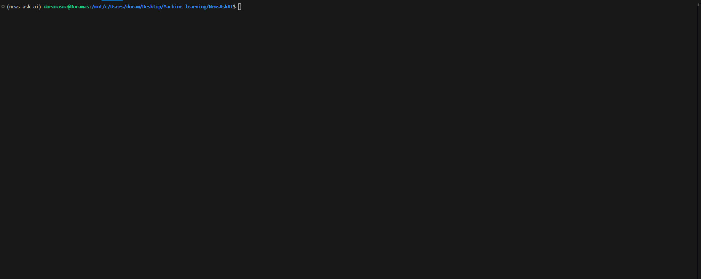

# NewsAskAI

<div align="center">

</img> 

</div>

**NewsAskAI** is an open-source project designed to scrape the latest news on a user-specified topic and generate a curated list of the most relevant articles. It leverages Retrieval-Augmented Generation (RAG) to enable users to ask questions about the news and receive context-rich, real-time answers. The project is powered by open-source Hugging Face embeddings, the Phi-3.5 Large Language Model, and Chroma DB for efficient storage and retrieval of embeddings.

Additionally, it features a user interface built with Textual, replicating the experience of a conversational chat.

## Example

<div align="center">

</img> 

</div>

## 🚧 **Work in Progress: Future Steps**  

- **Download Full Articles**: Implement functionality to download the entire article found based on the specified topic. 
  - *Note: Currently, the system only retrieves the titles and abstracts of articles.*
- **Parametrization**: Parameterize the application, allowing users to switch between different configuration settings easily.
- **Multiple Topics**: Enable ingestion of multiple topics simultaneously or allow users to explore top news across various categories (e.g., sports, technology, politics) without requiring a new ingestion process for each category.
- **Optimize the inference speed:** Improve the system's performance to ensure faster and more efficient real-time responses to user queries.
  - *Note: The current performance is too slow.*
- **Topic Modeling / Named Entity Recognition**: Add advanced features, such as a second processing stage, to label or tag articles for more efficient query filtering or to perform reranking of the embeddings.
  - *Example: Allow users to filter results by entities (e.g., “Filter by entity: ‘Doramas Baez’”) or specific topics.*

## Requirements

### Windows 

- **uv**: it provides a standalone installer to download and install uv:

  ```<sh>
  powershell -ExecutionPolicy ByPass -c "irm https://astral.sh/uv/install.ps1 | iex"
  ```

- **make**: To install make in windows we will need to have chocolatey, to install it you should run in admin mode the following command:
  ```<sh>
  Set-ExecutionPolicy Bypass -Scope Process -Force; [System.Net.ServicePointManager]::SecurityProtocol = [System.Net.ServicePointManager]::SecurityProtocol -bor 3072; iex ((New-Object System.Net.WebClient).DownloadString('https://community.chocolatey.org/install.ps1'))
  ```
 
  Then, to install make do this:
    ```<sh>
    choco install make
    ```
-  **Microsoft Visual C++ 14.0**:
    ```<sh>
    choco install visualstudio2022buildtools visualstudio2022-workload-vctools
    ```

### macOS/linux

**Uv** is a single command line executable. There are a number of ways to install it, but the easiest is to use the provided installation script:

```<sh>
curl -LsSf https://astral.sh/uv/install.sh | sh
source $HOME/.local/bin/env
```

## How to Use It

This project includes a `Makefile` to automate common tasks like linting, type checking, and running the application. Below are the available commands:

### Install Dependencies and Create a Virtual Environment

For general systems:

```console
$ make install
```

For systems with CUDA support:

```console
$ make install-cuda
```

### Run the application after performing linting and type checking:

```console
$ make run
```
